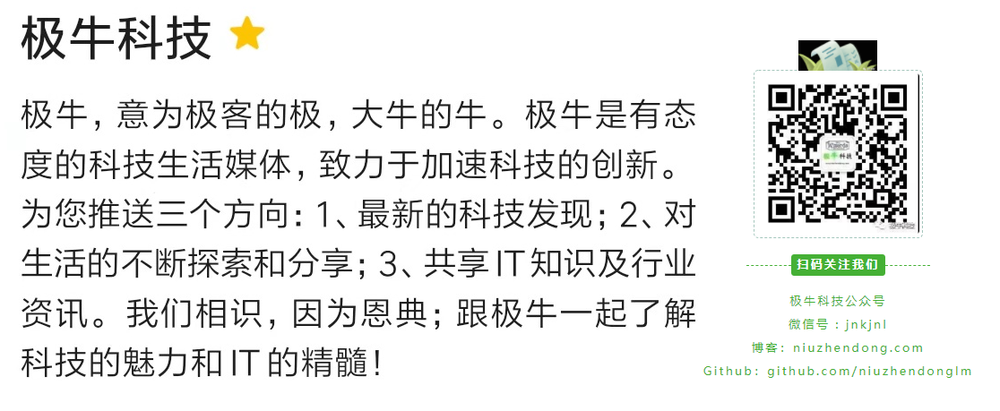

关注公众号：jnkjnl。让我们一起进步，在学习中感受快乐！

##  Java 基础

1. [**十大经典排序算法最强总结**](https://mp.weixin.qq.com/s?__biz=MzIzNDkwMTI3MQ==&mid=2247483790&idx=1&sn=df53657605e02dea480ab08928fc57c0&chksm=e8ee1bf6df9992e01718ab519520a46977ea52df63c739c298503321e3babac315e2d5bb0df7&token=1716705143&lang=zh_CN#rd)
2. **[Java 开发中常用的 4 种加密方法](https://mp.weixin.qq.com/s?__biz=MzIzNDkwMTI3MQ==&mid=2247483827&idx=1&sn=1996c2f593783e808817babee2a7e822&chksm=e8ee1bcbdf9992dd45ec12b697634326271615beef50700db5eb5e46d91aa731b14ada4e2e75&token=408633767&lang=zh_CN#rd)**
3. **[“短链接”介绍及实现](https://mp.weixin.qq.com/s?__biz=MzIzNDkwMTI3MQ==&mid=2247483846&idx=1&sn=5db337ea880fa244470323918c5490b9&chksm=e8ee1bbedf9992a8e1f4e567c8192ebf0d1d9f4052f4f4cf53e09bb968a3669d2489717bab70&token=1367074363&lang=zh_CN#rd)**
4. **[Java 的 JSP 已经被淘汰了吗？](https://mp.weixin.qq.com/s?__biz=MzIzNDkwMTI3MQ==&mid=2247483855&idx=1&sn=44918a35c76664ec638234bef27809bf&chksm=e8ee1bb7df9992a11b75762f77ba1af8694286d98316ac9c5d77543fde8a7a5cf5b32f08d6e5&token=1331035447&lang=zh_CN#rd)**

##  Spring

1. [**Spring IOC 初始化过程详解**](https://mp.weixin.qq.com/s?__biz=MzIzNDkwMTI3MQ==&mid=2247483767&idx=1&sn=9aec0d7aef4a88a1d6e8cdeddfcc35dd&chksm=e8ee1b0fdf9992194c54952a6104b39b1292982ad40943cca5bf82d6c8f762269ccd8334199f&token=1128304733&lang=zh_CN#rd)

##  Spring Boot

1. **[SpringBoot 的 banner.txt](https://mp.weixin.qq.com/s?__biz=MzIzNDkwMTI3MQ==&mid=2247483896&idx=1&sn=ffd638ac7c772eefa0157c0a1e963cad&chksm=e8ee1b80df9992963bf5722d768ed2a6ee97e26299c19ac11d1c8146feca8c8e770e3033d9a5&token=714336520&lang=zh_CN#rd)**
2. **[绝了！Dataway 让 Spring Boot 不再需要 Controller、Service、DAO、Mapper](https://mp.weixin.qq.com/s?__biz=MzIzNDkwMTI3MQ==&mid=2247483949&idx=1&sn=15f67019c81d475dd548c4567f39d7d7&chksm=e8ee1855df999143e67a146aa19c379ca9c017620a411d8ce2f0296fd97012b927da7baf8c8d&token=797830367&lang=zh_CN#rd)**

##  Spring Cloud

1. **[Spring Cloud Eureka 简介和代码实现](https://mp.weixin.qq.com/s?__biz=MzIzNDkwMTI3MQ==&mid=2247483863&idx=1&sn=52e65861f6bb09caeafc7df8a0a9c338&chksm=e8ee1bafdf9992b97635b76dd92eb1dd1fa0afc28fd4720db2eb28c045e4a9e81f73c8967e7f&token=1488902983&lang=zh_CN#rd)**

## Mybatis

1. **[Mybatis 用到了哪几种设计模式](https://mp.weixin.qq.com/s?__biz=MzIzNDkwMTI3MQ==&mid=2247483816&idx=1&sn=ceb234e24d1d779dfab599d3565aa2da&chksm=e8ee1bd0df9992c6554b9cd39007160261fcf9ee6bd00a0c9fd06d7ea6f224b261569858b9cb&token=332542580&lang=zh_CN#rd)**

##  Linux

1. **[Linux 简介及最常用命令](https://mp.weixin.qq.com/s?__biz=MzIzNDkwMTI3MQ==&mid=2247483754&idx=1&sn=73f2ddbba47f2653cd777e9db1d9e187&chksm=e8ee1b12df999204f285c3a81579d6edee51ad725ab606f9cbaa9c1a8aea0f60d0e561d24509&token=1128304733&lang=zh_CN#rd)**

##  Mysql

1. **[分库分表来实现不迁移](https://mp.weixin.qq.com/s?__biz=MzIzNDkwMTI3MQ==&mid=2247483763&idx=1&sn=9ec842f1c5578069cbc28a4d6b09bb3a&chksm=e8ee1b0bdf99921d1b21b2b91cbfd0702f5c1c34bdce498be6bda8c6da9ecd1bf89272c482fb&token=1128304733&lang=zh_CN#rd)**
2. **[8 种你正在写错的 SQL 语法](https://mp.weixin.qq.com/s?__biz=MzIzNDkwMTI3MQ==&mid=2247483822&idx=1&sn=ff15d9bc36a3bfa08011f535952aaa81&chksm=e8ee1bd6df9992c0556037001f8b30f1268856ee9631ba40e81efe670a2a25787cfab47496dd&token=594738703&lang=zh_CN#rd)**
3. **[Mysql 事务、四个特性和四种隔离级别解读](https://mp.weixin.qq.com/s?__biz=MzIzNDkwMTI3MQ==&mid=2247483837&idx=1&sn=18ac1c1d704bef13e04b5995c930c676&chksm=e8ee1bc5df9992d3348444936154ce5dbbe8db80762282a330fa30728753161ca2d676b17474&token=408633767&lang=zh_CN#rd)**

##  Redis

1. **[分享几个常见的 Redis 面试题](https://mp.weixin.qq.com/s?__biz=MzIzNDkwMTI3MQ==&mid=2247483771&idx=1&sn=71cc23d998d8d15d245fd847c1446942&chksm=e8ee1b03df999215d920c00f278d467b932fd55b01b965f95acca02bf63d9355dde5c55dcf27&token=1128304733&lang=zh_CN#rd)**

##  工具使用

1. **[IDEA 应该加这些配置](https://mp.weixin.qq.com/s?__biz=MzIzNDkwMTI3MQ==&mid=2247483780&idx=1&sn=7c41b82b709a2fd7f1ac6200e0935a09&chksm=e8ee1bfcdf9992eaffdba0477ce59ca39805c249ea01f2527473f92de52df3f56001da64e153&token=240401638&lang=zh_CN#rd)**
2. **[终于可以告别单调的 swagger-ui 了，选择了它 —— knife4j](https://mp.weixin.qq.com/s?__biz=MzIzNDkwMTI3MQ==&mid=2247483919&idx=1&sn=618a3c8974d37d13983cc753c4b0ca6c&chksm=e8ee1877df99916179283c2d7e54020cb7af4f21b7f085195e0e437c3797f825a3d3e1f186ee&token=1992035891&lang=zh_CN#rd)**

## **Elasticsearch**

1. **[破解版 elasticsearch docker 镜像](https://mp.weixin.qq.com/s?__biz=MzIzNDkwMTI3MQ==&mid=2247483868&idx=1&sn=e06680b2e47ad102ee9a1d4d51450c13&chksm=e8ee1ba4df9992b2ea3505728d1e0601b54395ef1adbc2b2eeaa43e6fa699f288ec1948d6be8&token=1402633157&lang=zh_CN#rd)**
2. **[docker 方式部署带用户权限管理的 elasticsearch 集群和 kibana](https://mp.weixin.qq.com/s?__biz=MzIzNDkwMTI3MQ==&mid=2247483872&idx=1&sn=5026140ff35472a6cacc86641b377ea5&chksm=e8ee1b98df99928e381604efd22834e04f820d3b444c05f5e7248950932ede632953d4c09328&token=1402633157&lang=zh_CN#rd)**

##  其它

1. **[推荐 10 个堪称神器的网站](https://mp.weixin.qq.com/s?__biz=MzIzNDkwMTI3MQ==&mid=2247483850&idx=1&sn=e51ccb17a6379adda1001249dfa7b0f0&chksm=e8ee1bb2df9992a48efcbd9c407a4c7e2929734e421ec8b5a40d78e7358de89e02c3c0127655&token=962470132&lang=zh_CN#rd)**
2. **[12306 的架构到底有多牛逼？](https://mp.weixin.qq.com/s?__biz=MzIzNDkwMTI3MQ==&mid=2247483892&idx=1&sn=73bfa90ae3475da9701892503de738df&chksm=e8ee1b8cdf99929ac472bb1e3dc1dd115189c34a8a58a9bd778cda904ffca686e44d40ad87ed&token=1402633157&lang=zh_CN#rd)**
